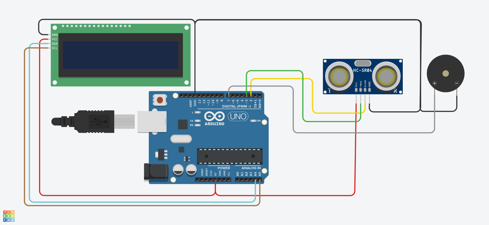
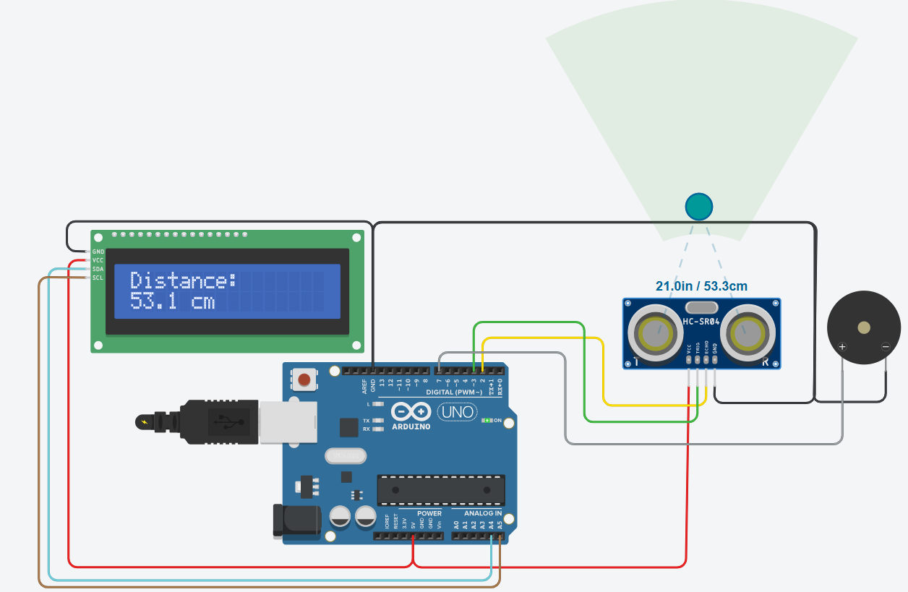

Proximity Alert System (Arduino)

An Arduino-based proximity alert system that:
- Uses an HC-SR04 ultrasonic sensor to measure distance
- Displays the live distance on a 16x2 I2C LCD
- Activates a pulsing buzzer if an object is closer than 10 cm

## Features
- Real-time distance display on LCD
- Buzzer pulses as a proximity warning
- Ideal for collision detection, obstacle sensing, or entry alerts

## Components
- Arduino UNO
- HC-SR04 Ultrasonic Sensor
- 16x2 LCD (I2C)
- Buzzer
- Jumper wires, Breadboard

## Circuit Diagram

## Working Diagram

## Working Diagram

